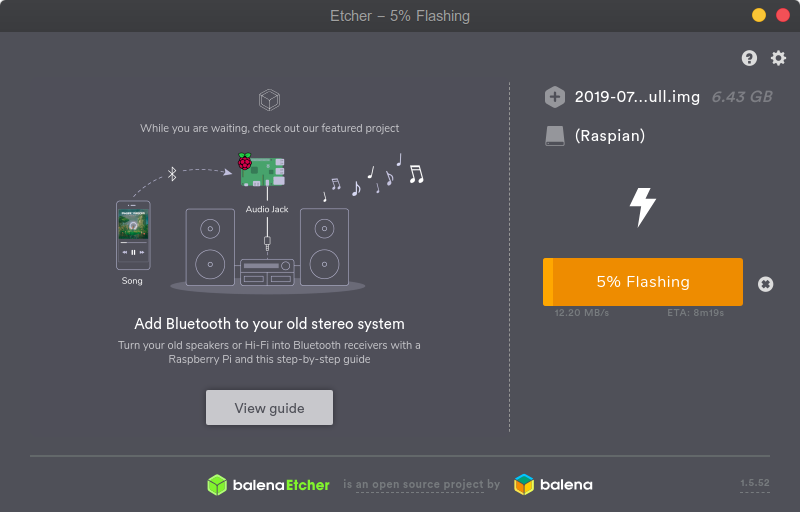

# Setting up Raspberry Pi (Connecting direct from laptop vis Ethernet)

# Flashing Raspberry Pi
* First you need a micro sd card of minimum 8Gb space,with FAT format.
* Then you need a software to flash to the sd. In our case its https://www.balena.io/etcher/. Download the current platform image.
* Now lets download the latest image of raspian from here https://www.raspberrypi.org/downloads/raspbian/. I am using Raspbian Buster with desktop and recommended software.
* Unzip etcher and launch the app.
* Select the downloaded raspian zip file. Etcher shold select correct sd card, if not then select that. Then click Flash. You should see the following screen

* In my case I would like to have ssh to be enabled, so to do that you can create a ssh file in the sd card's boot partition. the file content does not matter just the file name ssh is enough. https://www.raspberrypi.org/documentation/remote-access/ssh/

* Unmost the sd card and pop it in the raspberrypi.
* Now, these steps are important if you would like to avoid the hassle of having another monitor, keyboard, mouse to connect to the raspberrypi. 
* Instead we will connect it just from the PC or laptop in my case, just by using the ethernet cable. 
* Note: I am using Ubuntu and I will explain how to do it on ubuntu.
* First install the following tools net-tools and nmap.
* sudo apt-get install net-tools
* sudo apt-get install nmap
* 

## Notes
* sudo apt-get update
* sudo apt-get install realvnc-vnc-server
* systemctl start vncserver-x11-serviced.service